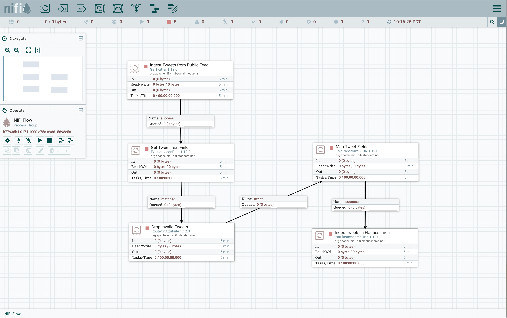

# tweet-nifi

Tweet-nifi provides the capability to receive tweets from the Twitter public feed with NiFi and injest them into Elasticsearch.

## System Requirements

1. Download and install [NiFi](https://nifi.apache.org/download.html)
2. Download and install [Elasticsearch](https://www.elastic.co/downloads/elasticsearch)

## Installation

1. Start Elasticsearch instance.
1. Start your NiFi instance.
1. Navigate to the NiFi console in your browser, which will be *http://localhost:8080*.
1. Open a browser window to your NiFi instance.
1. Click on the **Upload Template** button in the **Operate** pane.
1. Click on the maginfying glass icon next to the text **Select Template** in the **Upload Template** pane.
1. Navigate to the directory where you unpacked the tweet-nifi tarball. 
1. Select the *tweet-nifi.xml* file.
1. Click **Open**.
1. Click on the **UPLOAD** button in the **Upload Template** pane.
1. Click on the **Template** button on the top of the NiFi window, then drag it to the open canvas.
1. Double click on the **Ingest Tweets from Public Feed** processor.
1. Enter the **Consumer Key**, **Consumer Secret**, **Access Token**, and **Access Token Secret** field values. Note the **Consumer Key** and **Consumer Secret** fields correspond to the Twitter **API key** and **API key secret** fields, respectively.
1. Click on the **APPLY** button.
1. Double lick on the **Index Tweets in Elasticsearch** processor.
1. Click on the the **Elasticsearch URL** field.
1. Enter the URL to your Elasticsearch instance.
1. Click on **OK**.
1. Click on the **Index** field. 
1. Enter the index naming pattern you want to use for your time series indices.  The default is `tweets-${now():format('yyyy.MM.dd')}`.
1. Click on OK.
1. Click on the **APPLY** button.

The Nifi canvas should look like this when you are done:

## Run Pipeline

Click on the **Start** button in the **Operate** pane in the NiFi Console, which should be labelled **NiFi Flow**.  After several seconds you should see the *In*, *Read/Write*, *Out*, and *Tasks/Time* field totals increasing.  Verify that your tweet stream is being indexed but running a query like this in Kibana:

    GET tweets-2020.09.22/_search
    
Here we are assuming the tweets were ingested on Sep 27, 2020.  The output should look like this:

    {
      "took" : 0,
      "timed_out" : false,
      "_shards" : {
        "total" : 1,
        "successful" : 1,
        "skipped" : 0,
        "failed" : 0
      },
      "hits" : {
        "total" : {
          "value" : 9551,
          "relation" : "eq"
        },
        "max_score" : 1.0,
        "hits" : [
          {
            "_index" : "tweets-2020.09.27",
            "_type" : "_doc",
            "_id" : "4Fzx0XQBAxCM3ol7ftQk",
            "_score" : 1.0,
            "_source" : {
              "created_at" : "Sun Sep 27 22:17:11 +0000 2020",
              "timestamp_ms" : "1601245031657",
              "id_str" : "1310342751716880386",
              "text" : "RT @robbystarbuck: Breaking news: You guys are gonna want to sit down for this. It turns out rich people and their companies have entire te…",
              "source" : """<a href="http://twitter.com/download/iphone" rel="nofollow">Twitter for iPhone</a>""",
              "favorited" : false,
              "retweeted" : false,
              "lang" : "en",
              "user_id_str" : "868768568283975680",
              "user_name" : "Sahidkapadia",
              "user_screen_name" : "Sahidkapadia3",
              "user_description" : null,
              "user_verified" : false,
              "user_followers_count" : 91,
              "user_friends_count" : 526,
              "user_listed_count" : 0,
              "user_favourites_count" : 127917,
              "user_created_at" : "Sun May 28 09:59:02 +0000 2017",
              "user_lang" : null
            }
          },
       ...
    }
                            
Tweets fields are mapped to output fields in **Jolt Specification** field the **Map Tweet Fields** processor.  The default mapping is:

    [
      {
        "operation": "shift",
        "spec": {
          "created_at": "created_at",
          "time_zone": "time_zone",
          "utc_offset": "utc_offset",
          "timestamp_ms": "timestamp_ms",
          "id_str": "id_str",
          "text": "text",
          "source": "source",
          "favorited": "favorited",
          "retweeted": "retweeted",
          "possibly_sensitive": "possibly_sensitive",
          "lang": "lang",
          "user": {
            "id_str": "user_id_str",
            "name": "user_name",
            "screen_name": "user_screen_name",
            "description": "user_description",
            "verified": "user_verified",
            "followers_count": "user_followers_count",
            "friends_count": "user_friends_count",
            "listed_count": "user_listed_count",
            "favourites_count": "user_favourites_count",
            "created_at": "user_created_at",
            "lang": "user_lang"
          },
          "entities": {
            "urls": {
              "*": {
                "url": "url_&1",
                "expanded_url": "url_expanded_&1",
                "display_url": "url_display_&1"
              }
            }
          }
        }
      }
    ]

Note that this mapping allows for 3 URLs in the tweet that are flattened out at the top level of the JSON.

If you want to map more or fewer fields, or use different Elasticsearch field names, you can change this specification as needed. If and when you update the field mapping, you must restart Nifi.
